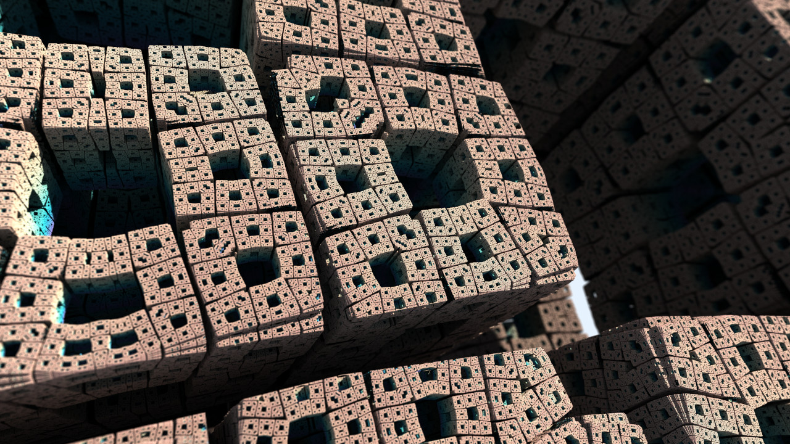

# cl-renderer

OpenCL based rendering application.



I've made this project to experiment, primarily, with ray marching/path tracing. Fractal renderering. Things like this.

This is a, very much, work in progress project.

## Getting Started

### Prequisites
- CMake https://cmake.org/
- OpenCL runtime.
- vcpkg https://github.com/microsoft/vcpkg
    - Manually clone and bootstrap vcpkg according to instructions.
        - https://learn.microsoft.com/en-us/vcpkg/get_started/get-started?pivots=shell-cmd
    - Set the `VCPKG_ROOT` environment variable to vcpkg root directory.
    - Or use CMake argument `-D VCPKG_ROOT=<path to vcpkg root directory>`

### Building
```
$ git clone https://github.com/matthewgattis/cl-renderer.git
$ mkdir -p cl-renderer/build
$ cd cl-renderer/build
$ cmake -D CMAKE_BUILD_TYPE=Release ../
$ cmake --build .
```

### Render Test Image
- Render the test image with default arguments:
- `./cl-renderer --platform "NVIDIA CUDA" --device "Quadro TRX 3000" ../program.cl`
- Use application like `clinfo` to find platform and device.
- Default is to use first platform and first device.
- Use `--help` for more options:
``` text
Usage: cl-renderer [-h] [--kernel VAR] [--image-count VAR] [--start-frame VAR] [--output VAR] [--width VAR] [-h] [--tile-size VAR] [--samples VAR] [--platform VAR] [--device VAR] program

Positional arguments:
  program          	file name of OpenCL program to load [default: "program.cl"]

Optional arguments:
  -h, --help       	shows help message and exits
  -v, --version    	prints version information and exits
  -k, --kernel     	name of kernel entry point [default: "mainimage"]
  -c, --image-count	number of image frames to generate [default: 1]
  --start-frame    	number of frames to skip [default: 0]
  -o, --output     	output file name(s) [default: "frame-%04d.png"]
  -w, --width      	image(s) width [default: 960]
  -h, --height     	image(s) height [default: 640]
  -t, --tile-size  	tile, or chunk, size to use when splitting up the image [default: 128]
  -s, --samples    	number of sample to run  for each pixel [default: 64]
  -p, --platform   	name OpenCL platform to use [default: ""]
  -d, --device     	name of OpenCL device to use [default: ""]
```